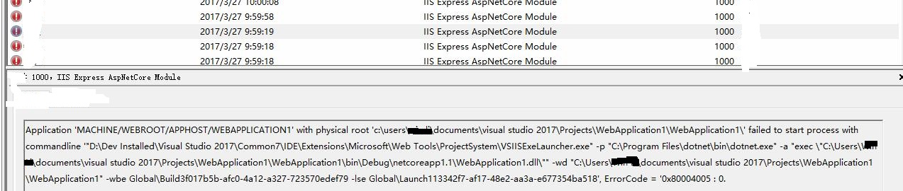

# dotnetCoreUniversity

## Project Tutorial
> [Get started with ASP.NET Core MVC and Entity Framework Core](https://docs.microsoft.com/zh-cn/aspnet/core/data/ef-mvc/)

## Dev Environment
  - Visual studio 2017 Enterprise Build 26228.10
  - SQL server Express LocalDb
  - Windows 7 x64

## Frameworks
  - dotnet Core 1.1

## Completed Items
  1. Getting started
  2. Create, Read, Update, and Delete operations
  3. Sorting, filtering, paging, and grouping
  4. Migrations
  5. Creating a Complex data model
  6. Reading related data

## Questions on halfway 
  ### Question 1
  1. Use VS2017 create a default dotnet Core Web App with template: **ASP.NET Core Web Application(.NET Core)**
  2. When I click Ctrl+F5 to start it, and it has error (PS: this error happened on Win10 x64)
    

  3. Tries

  - I created another new web Appplication, and it failed.
  - I repair Visual Studio 2017 about 3 times, it is success.
  - _PS: I search from Bing/Google, but I cann't find the solution's Web.config position, in other words, i am green hand with core_

-------------

  ### Question 2
  1. Configure the university.csproj. Add the following item
  ```
  <DotNetCliToolReference Include="Microsoft.EntityFrameworkCore.Tools.DotNet" Version="1.0.0" />
  ```
  2. The purpose is to use **dotnet ef Tools**
  3. The alternative way is use **Package Manager Console**, I'm not try it yet.

-------------  

  ### Question 3 (Current)

  1. I using scaffolding to add Controller
  
  2. Then I choose my Model and Context (Code First by Entity Framework Core),  I got an error. not resolve it yet.
  
  3. The reasons probably is the versions aren't correct, or Visual Studio 2017 CodeGeneration has some bugs.